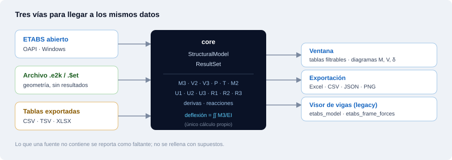

# Extractor ETABS

Aplicación de escritorio para abrir modelos de **ETABS** y extraer **momentos,
cortantes, axiales, torsiones, desplazamientos, derivas y deflexiones** para los
casos de carga y combinaciones que elijas, con exportación a Excel, CSV y JSON.

Nace del visor `Vigas ETABS` de Strux (incluido en [`legacy/`](legacy/)), que ya
esperaba un puente de escritorio con ETABS. Aquí ese puente existe de verdad: se
conecta a la OAPI, y además funciona sin ETABS instalado leyendo archivos `.e2k`
y tablas exportadas.



---

## Qué extrae

| Cantidad | Origen | Tabla equivalente en ETABS |
|---|---|---|
| Momentos `M2`, `M3`, cortantes `V2`, `V3`, axial `P`, torsión `T` por estación | `Results.FrameForce` | *Element Forces - Beams / Columns* |
| Desplazamientos `U1`, `U2`, `U3` y rotaciones `R1`, `R2`, `R3` de nudos | `Results.JointDispl` | *Joint Displacements* |
| Derivas de entrepiso | `Results.StoryDrifts` | *Story Drifts* |
| Reacciones en la base | `Results.BaseReact` | *Base Reactions* |
| Deflexión a lo largo de la trabe | **cálculo propio** (doble integración de `M3/EI`) | — |

Todo lo demás es lectura directa de ETABS. La deflexión es lo único que la
aplicación calcula, y se etiqueta como tal en la interfaz, en el resumen y en
cada exportación (ver [Deflexiones](#deflexiones-el-único-cálculo)).

## Tres vías de datos

La aplicación no obliga a tener ETABS abierto en la misma máquina:

| Geometría | Resultados | Requiere ETABS | Deflexiones |
|---|---|---|---|
| ETABS abierto (OAPI) | OAPI | sí (Windows) | sí |
| ETABS abierto (OAPI) | tabla exportada | sí | sí |
| archivo `.e2k` / `.$et` | tabla exportada | **no** | sí |
| archivo `.e2k` | — | no | no (falta `M3`) |
| — | tabla exportada | no | no (faltan secciones) |

Cuando algo falta, se dice cuál es el faltante y por qué, en vez de rellenarlo
con un supuesto.

---

## Instalación

Requiere **Python 3.9 o superior**.

```bash
pip install -r requirements.txt
```

En Windows, para hablar con ETABS:

```bash
pip install comtypes          # enlace recomendado
# o bien
pip install pythonnet         # alternativa; usa ETABSv1.dll
```

Comprueba el entorno antes de empezar:

```bash
python -m extractor_etabs diagnostico
```

```
Extractor ETABS 1.0.0
Python              : 3.11.9 (win32)
Plataforma con OAPI : sí
Enlaces disponibles : comtypes
PySide6             : 6.11.1
openpyxl            : 3.1.5
OAPI                : lista
```

## Uso

### Ventana

```bash
python run.py
# o
python -m extractor_etabs
```

El flujo está numerado en el panel izquierdo, igual que en el programa original:

1. **Fuente de datos** — «Conectar con ETABS abierto», «Abrir modelo en ETABS…»
   (`.EDB`, `.E2K`, `.$ET`, `.xlsx`), «Leer geometría del modelo»; o, sin ETABS,
   «Cargar geometría de `.e2k`» e «Importar tabla exportada».
2. **Qué extraer** — cantidades, tipos de barra, sistema de unidades, `E` y el
   factor de inercia para las deflexiones.
3. **Casos de carga y niveles** — casos y combinaciones con casilla, y filtro
   por nivel (sin marcar = todos).

Luego, **Extraer de ETABS**. Los resultados aparecen en cuatro pestañas:

- **Modelo** — procedencia, conteos, faltantes, avisos, barras por nivel y
  secciones con sus dimensiones (y de dónde salieron).
- **Resultados** — una tabla por cantidad, con filtros por nivel, elemento y
  caso, búsqueda libre, orden por columna, decimales ajustables y copiado
  directo a Excel (`Ctrl+C`).
- **Diagramas** — `M3`, `V2` y la deflexión de la barra y el caso elegidos, más
  la envolvente sobre todos los casos extraídos. Se guardan como PNG.
- **Registro** — todo lo que pasó, para pegar en un correo cuando algo falle.

### Línea de comandos

Para lotes y tareas programadas:

```bash
# Sin ETABS: geometría de un .e2k + tabla exportada, a Excel
python -m extractor_etabs offline \
    --e2k modelo.e2k --tabla fuerzas.csv desplazamientos.csv \
    --deflexiones --xlsx resultados.xlsx

# Con ETABS: abrir un modelo, extraer todos los casos y combinaciones
python -m extractor_etabs etabs \
    --abrir "C:\modelos\torre.EDB" --todos --reacciones \
    --unidades Ton_m_C --xlsx torre.xlsx --json torre.json

# Solo dos combinaciones y un nivel, con el análisis corrido si hace falta
python -m extractor_etabs etabs \
    --combos "1.3CM+1.5CV" "CM+CV" --niveles Azotea \
    --correr-analisis --csv salidas/
```

`python -m extractor_etabs etabs --help` lista todas las banderas.

### Exportaciones

| Formato | Contiene |
|---|---|
| **Excel** (`.xlsx`) | una hoja por cantidad, más «Procedencia» (fuente, unidades, casos, faltantes y avisos) y «Barras del modelo» |
| **CSV** | un archivo por cantidad, con encabezado de procedencia y unidades en cada columna |
| **JSON** | resultados y geometría completos, para alimentar otros programas |
| **JSON del visor** | las cargas útiles `etabs_model` y `etabs_frame_forces` que consume [`legacy/Vigas_ETABS_autocontenido.html`](legacy/) |
| **PNG** | los diagramas trazados |

---

## Deflexiones: el único cálculo

ETABS no publica una tabla de deflexión a lo largo de la barra; entrega los
desplazamientos de los **nudos**. La aplicación integra dos veces la curvatura
`κ = M3/(E·I)` con los desplazamientos de los nudos extremos como condiciones de
frontera. Supuestos, todos explícitos:

- viga de Euler-Bernoulli con `E·I` constante en el claro;
- curvatura tomada solo de `M3` (flexión en el plano vertical);
- inercia bruta de la sección rectangular, multiplicable por el factor del panel
  (`1.00` = `Ig`; valores menores representan una inercia efectiva agrietada);
- sin desplazamientos de nudo, la flecha resulta **relativa a la recta que une
  los nudos** (es lo que se compara contra `L/240`);
- si la sección no tiene dimensiones legibles o hay menos de tres estaciones, no
  se calcula nada y se dice por qué.

El valor por omisión de `E` es `221 359 kgf/cm²`, que es `14000·√f'c` con
`f'c = 250 kg/cm²` (concreto clase 1, NTC-Concreto). Cámbialo en el panel o con
`--e` y `--e-unidades`.

La comprobación numérica está en las pruebas: viga libremente apoyada con carga
uniforme contra `δ = 5wL⁴/(384EI)`, y momento constante contra `M L²/(8EI)`.

---

## Estructura

```
extractor_etabs/
├── run.py                     lanzador
├── extractor_etabs/
│   ├── cli.py                 línea de comandos
│   ├── core/                  lógica sin interfaz (no importa Qt)
│   │   ├── etabs_api.py       conexión OAPI: comtypes y pythonnet
│   │   ├── extractors.py      lectura de geometría y resultados
│   │   ├── e2k_parser.py      lector de .e2k / .$et
│   │   ├── table_import.py    lector de tablas exportadas (CSV/TSV/XLSX)
│   │   ├── deflection.py      doble integración de M3/EI
│   │   ├── model.py           modelo de datos normalizado
│   │   ├── session.py         estado y flujo de una sesión
│   │   ├── export.py          CSV, Excel, JSON, resumen
│   │   ├── strux_payload.py   puente con el visor original
│   │   └── units.py           sistemas de unidades y eUnits de la OAPI
│   └── ui/                    interfaz PySide6
├── ejemplos/                  modelo .e2k y tabla de fuerzas de muestra
├── legacy/                    el visor original y su lector JS
├── docs/                      manual de uso y notas de arquitectura
└── tests/                     91 pruebas, incluido un ETABS simulado
```

La separación es deliberada: `core` no importa Qt, así que la misma lógica sirve
para la ventana, la CLI y cualquier script.

## Pruebas

```bash
python -m unittest discover -s tests
```

Las pruebas de la OAPI corren contra un **ETABS simulado**
([`tests/fake_etabs.py`](tests/fake_etabs.py)) que reproduce el `SapModel` con
las dos convenciones de parámetros por referencia (comtypes y pythonnet), así
que la ruta con ETABS queda verificada también en Linux y macOS. Las de interfaz
usan el *backend* `offscreen` de Qt y se omiten si PySide6 no está instalado.

## Empaquetado para Windows

Para entregar un `.exe` a alguien que no usa Python:

```bash
pip install pyinstaller
python empaquetar.py
```

Deja `dist/ExtractorETABS/ExtractorETABS.exe`. Ver
[`docs/manual.md`](docs/manual.md#empaquetado) para las opciones.

---

## Notas sobre ETABS

- La OAPI solo existe en **Windows**; en Linux y macOS la aplicación abre igual y
  trabaja con `.e2k` y tablas exportadas, indicándolo en el panel.
- Python y ETABS deben ser de la **misma arquitectura** (64 bits).
- ETABS entrega resultados solo si el modelo está **bloqueado**, es decir, con el
  análisis corrido. Si no lo está, la aplicación lo dice y puede pedir correrlo.
- Los resultados salen en las **unidades presentes** del modelo, así que la
  aplicación las fija antes de leer y guarda la etiqueta junto con los datos.
- Con modelos grandes se pide el grupo `All` en una sola llamada en lugar de una
  llamada por barra; si ETABS la rechaza, se cae al método barra por barra.

Cómo exportar cada tabla, y qué hacer cuando ETABS no responde, está en
[`docs/manual.md`](docs/manual.md).

## Licencia

MIT — ver [LICENSE](LICENSE).
